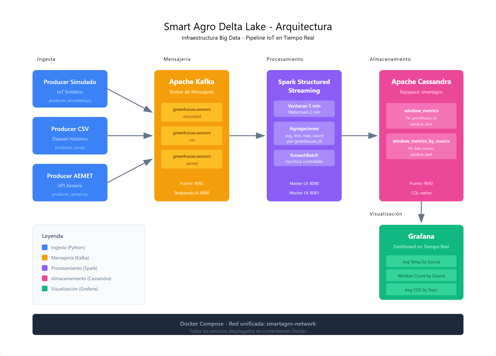

# Smart Agro Delta Lake

Proyecto base para la asignatura Infraestructura Big Data, orientado al arranque del TFM.

El flujo implementado cubre la entrega minima solicitada:

- Ingesta: tres producers Python independientes (simulado, CSV historico y API AEMET de Almeria) que publican en Kafka.
- Procesamiento: Spark Structured Streaming con ventanas temporales y agregaciones.
- Almacenamiento: persistencia de metricas agregadas en Cassandra.
- Visualizacion: dashboard de Grafana con paneles sobre Cassandra.
- Infraestructura: todo desplegado con Docker Compose en una unica red.

Ademas, se deja MinIO desplegado para la evolucion del TFM (lakehouse Bronze/Silver/Gold con Delta Lake).

## Arquitectura



1. `greenhouse/producer/producer_simulated.py`, `greenhouse/producer/producer_csv.py` y `greenhouse/producer/producer_aemet.py` generan eventos IoT de cada fuente.
2. Los eventos se publican en topics Kafka separados: `greenhouse.sensors.simulated`, `greenhouse.sensors.csv` y `greenhouse.sensors.aemet`.
3. Cada evento incluye `data_source` y `source_topic` para marcar su procedencia.
4. `greenhouse/spark/streaming_job.py` consume desde Kafka con Spark Structured Streaming.
5. Spark aplica watermark + ventana de 5 minutos y calcula agregados por invernadero.
6. Cada microbatch se escribe en Cassandra (`smartagro.window_metrics`) y tambien por procedencia (`smartagro.window_metrics_by_source`).
7. Grafana consulta Cassandra para visualizar tendencias operativas por invernadero y por fuente de dato.

## Estructura del repositorio

```text
.
|-- docker-compose.yml
|-- greenhouse
|   |-- cassandra
|   |   `-- init.cql
|   |-- grafana
|   |   `-- dashboard_greenhouse.json
|   |-- producer
|   |   |-- producer.py
|   |   |-- producer_aemet.py
|   |   |-- producer_csv.py
|   |   |-- producer_simulated.py
|   |   `-- common.py
|   |   `-- setup_topic.py
|   |-- spark
|   |   |-- Dockerfile
|   |   `-- streaming_job.py
|   `-- requirements.txt
`-- docs
`-- scripts
```

## Requisitos

- Docker + Docker Compose.
- Python 3.10+ en host (solo para producer y utilidades locales).

## Despliegue rapido

1. Levantar infraestructura:

```bash
docker compose up -d --build
```

2. Crear entorno Python local e instalar dependencias:

```bash
python3 -m venv .venv
source .venv/bin/activate
python3 -m pip install -r greenhouse/requirements.txt
```

3. Crear topic de Kafka:

```bash
python3 greenhouse/producer/setup_topic.py
```

4. Inicializar esquema de Cassandra:

```bash
docker compose exec -T cassandra cqlsh < greenhouse/cassandra/init.cql
```

5. Lanzar job de Spark Streaming (comando correcto):

```bash
docker compose exec spark-master /opt/project/greenhouse/spark/run-streaming.sh
```

6. Configurar AEMET para el productor meteorologico:

```bash
cp .env.example .env
# Edita .env y agrega AEMET_API_KEY
```

7. Iniciar los 3 producers con un unico script:

```bash
./scripts/start_producers.sh
```

El script prioriza `./.venv/bin/python3` automaticamente (si existe) para evitar errores de dependencias del Python global.

8. Comprobar estado de los producers:

```bash
./scripts/status_producers.sh
```

9. Parar los 3 producers:

```bash
./scripts/stop_producers.sh
```

Por defecto se usa `AEMET_STATION_ID=6325O` (Almeria Aeropuerto) y los logs se guardan en `logs/*.log`.

Puedes ajustar el comportamiento de cada fuente mediante variables de entorno antes de arrancar:

```bash
SIM_EPS=2 CSV_EPS=2 CSV_MAX_EVENTS=200 AEMET_EPS=0.0033 AEMET_MAX_EVENTS=0 ./scripts/start_producers.sh
```

## Comandos Make utiles

```bash
make up
make init-topic
make init-cassandra
make run-spark
make run-producer-simulated
make run-producer-csv
make run-producer-aemet
```

Scripts operativos recomendados:

```bash
./scripts/start_producers.sh
./scripts/status_producers.sh
./scripts/stop_producers.sh
```

## Troubleshooting rapido (si no ves datos)

1. Verifica que Spark este arrancado con `make run-spark` antes de lanzar el producer.
2. Este proyecto usa `startingOffsets=latest`: si enviaste eventos antes de arrancar Spark, no se leeran historicos; vuelve a enviar eventos.
3. Si ejecutas Spark con `spark-submit /opt/project/greenhouse/spark/run-streaming.sh` fallara. Debe ejecutarse directamente el script `run-streaming.sh`.
4. En Linux, usa `python3` (no siempre existe el comando `python`).
5. Si AEMET falla, revisa `AEMET_API_KEY` en `.env` y conectividad de red.
6. Si `status_producers.sh` muestra `PID stale`, revisa `logs/*.log`; normalmente indica falta de dependencias en el interprete Python usado. Relanza `start_producers.sh` tras instalar `greenhouse/requirements.txt` en `.venv`.

## Grafana

- URL: `http://localhost:3000`
- Usuario: `admin`
- Password: `admin`

Pasos:

1. Instalar datasource Cassandra (ya se instala por variable `GF_INSTALL_PLUGINS`).
2. Crear datasource `Cassandra` apuntando a host `cassandra:9042`, keyspace `smartagro`.
3. Importar dashboard desde `greenhouse/grafana/dashboard_greenhouse.json`.

Paneles adicionales incluidos para trazabilidad de origen:

1. Average Temperature by Data Source
2. Last Window Count by Source
3. Average CO2 by Source Topic

## Puertos principales

- Kafka broker externo: `9092`
- Redpanda Console: `8090`
- Spark master UI: `8080`
- Spark worker UI: `8081`
- Cassandra: `9042`
- Grafana: `3000`
- MinIO API: `9000`
- MinIO Console: `9001`

## Decisiones de diseno

- Ventanas de 5 minutos para monitorizacion operativa estable y simple de justificar.
- Cassandra como store de lectura rapida para paneles live.
- `foreachBatch` en Spark para controlar escritura y mantener flexibilidad.
- MinIO incluido para el camino de TFM sin afectar la entrega minima de la asignatura.

## Siguientes pasos para TFM

1. Duplicar el stream hacia MinIO como capa Bronze.
2. Crear pipelines batch Silver y Gold con Delta Lake.
3. Entrenar modelos Spark MLlib con datos Gold.
4. Ampliar dashboard con paneles historicos y predicciones.
